# Biostatistical Analysis of Ethanol Pharmacokinetics

This repository contains the final project from the professional retraining program «Biostatistics and Medical Data Analysis» of the [Bioinformatics Institute](https://bioinf.me/en).

Our study investigates ethanol pharmacokinetics using biostatistical modeling approaches. We assessed the influence of multiple covariates on key pharmacokinetic parameters by fitting linear regression models.

## Table of content

[Structure of repository](https://github.com/petrov-aleks/IB-project-ethanol-pk-analysis/blob/main/README.md#structure-of-repository)

[Introduction](https://github.com/petrov-aleks/IB-project-ethanol-pk-analysis/blob/main/README.md#introduction)

[Goal and objectives](https://github.com/petrov-aleks/IB-project-ethanol-pk-analysis/blob/main/README.md#goal-and-objectives)

[Data](https://github.com/petrov-aleks/IB-project-ethanol-pk-analysis/blob/main/README.md#data)

[Study plan](https://github.com/petrov-aleks/IB-project-ethanol-pk-analysis/blob/main/README.md#study-plan)

[Results](https://github.com/petrov-aleks/IB-project-ethanol-pk-analysis/blob/main/README.md#results)

[Software Requirements](https://github.com/petrov-aleks/IB-project-ethanol-pk-analysis/blob/main/README.md#software-requirements)

[Contributors](https://github.com/petrov-aleks/IB-project-ethanol-pk-analysis/blob/main/README.md#contributors)

[References](https://github.com/petrov-aleks/IB-project-ethanol-pk-analysis/blob/main/README.md#references)

## Structure of repository

-   [data/raw](data/raw/) - raw input data;

-   [figures](figures/) - figures for readme page;

-   [renv](renv/) - renv infrastructure files;

-   [Ethanol_Pharmacokinetics_Report.Rmd](Ethanol_Pharmacokinetics_Report.Rmd) - main RMarkdown file containing the full analysis;

-   [Ethanol_Pharmacokinetics_Report.html](Ethanol_Pharmacokinetics_Report.html) - rendered HTML report (**please download before opening this file**);

-   [renv.lock](renv.lock) - locked package versions and dependencies.

## Introduction

Alcohol consumption remains a major contributor to the global burden of disease: in 2021 it ranked among the leading causes worldwide, and it is causally linked to more than 200 diagnostic categories. Alcohol dependence affects about 3.7% of the world’s adult population, and the economic costs attributed to alcohol use have been estimated at 2.6% of global GDP [1]. These facts motivate quantitative analyses of variability in ethanol pharmacokinetics across studies and conditions.

Ethanol pharmacokinetics (PK) after typical doses can be described by a one-compartment model with concentration-dependent (capacity-limited) elimination. Over relevant concentration ranges, a pseudo-linear decline may be observed (approximate zero-order behavior), which can justify a simplified linear description for specific analyses [2].

In this project, we quantified ethanol pharmacokinetic endpoints from published human datasets. The analysis was conducted in two stages. First, we explored models aimed at maximizing the coefficient of determination ($R^2$). Second, we focused on a predefined set of factors of primary interest: body weight (using three alternative metrics), sex, and feeding status.

Additionally, we evaluated allometric scaling approaches using both classical power exponents and exponents proposed by Matsumoto to assess their applicability to ethanol pharmacokinetics.

## Goal and Objectives

So, the **goal of a project** is characterize ethanol pharmacokinetics (PK) using noncompartmental analysis and biostatistical methods, quantify variability, assess covariate effects, and evaluate translational scaling between human and rat PK.

**Objectives**:

-   Describe each ethanol PK dataset (design, dosing, sampling, covariates), calculate and harmonize PK variables.

-   Visualize individual profiles: plot subject-level concentration–time curves within each dataset to assess variability and data quality.

-   Build an explanatory model: fit and validate regression models linking PK outcomes to covariates.

-   Replicate the workflow in animal data and compare/scale results (e.g., allometric translation)

## Data

Human ethanol pharmacokinetic data (8 datasets) [3–8] and rat data (2 datasets) [9, 10] were analyzed.

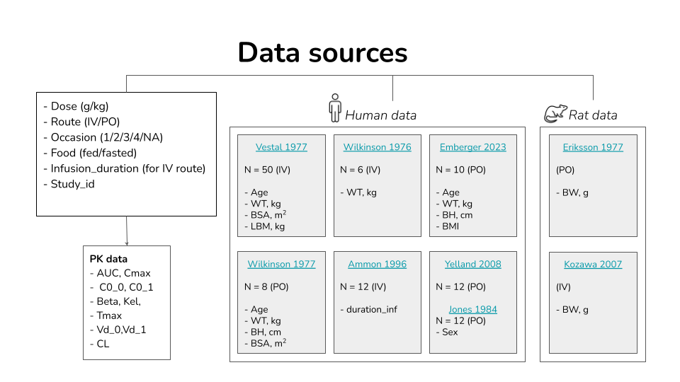

## Study Plan

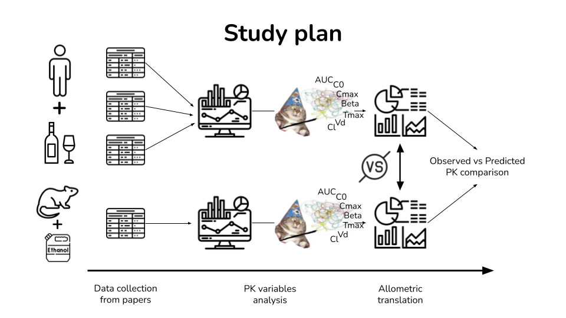

## Results

### Data-Driven Model Exploration

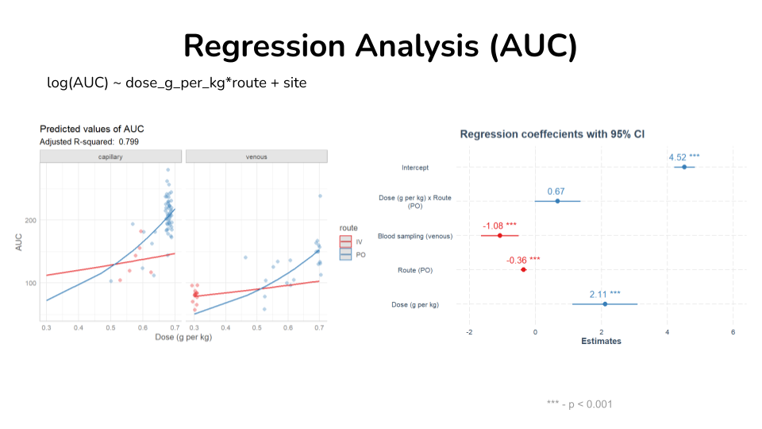

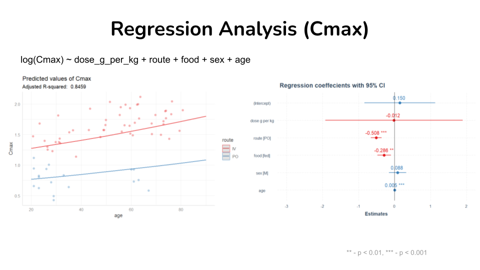


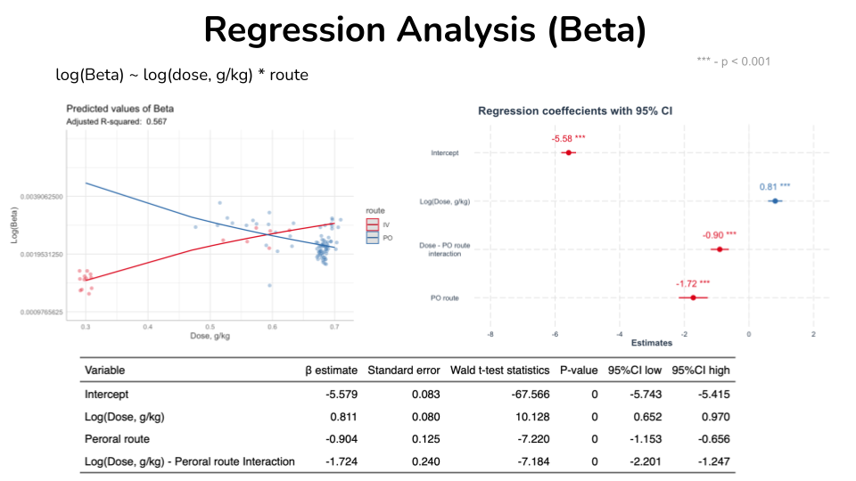

### Hypothesis-Driven Covariate Modeling


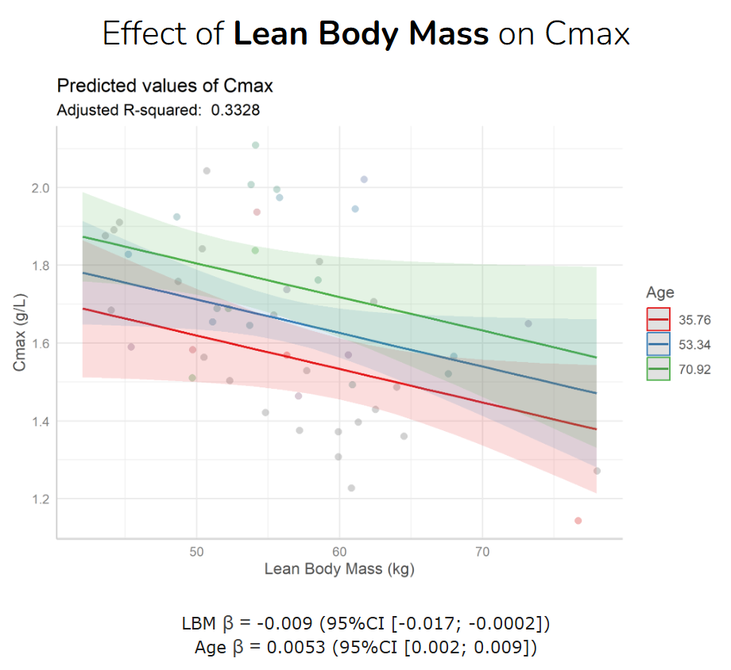

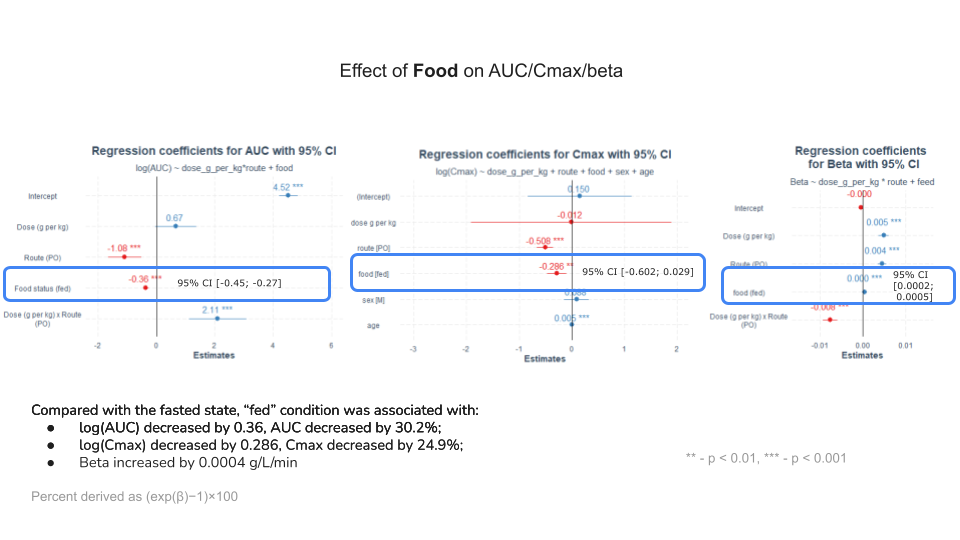

### Allometric scaling (metric)

*Relative error (%)*

$$
\text{Relative error} =
\frac{\text{Predicted} - \text{Observed}}{\text{Observed}} \times 100
$$

**IV route of administrations**

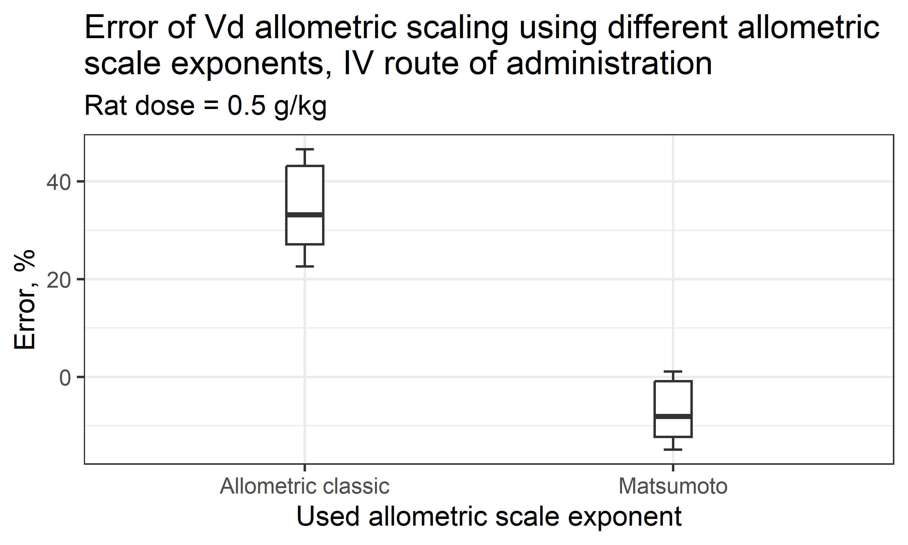

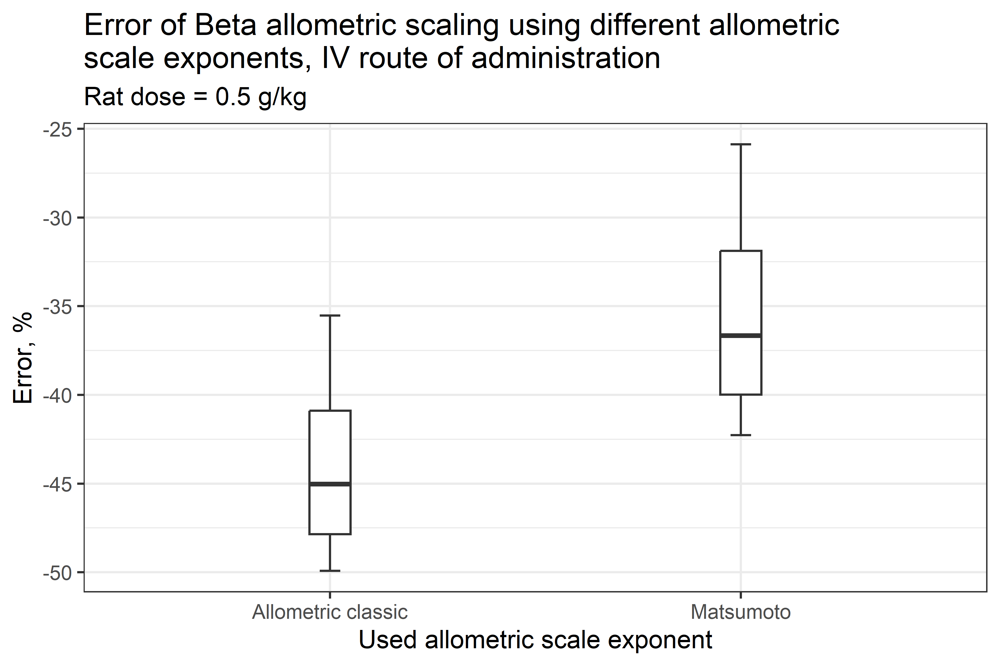

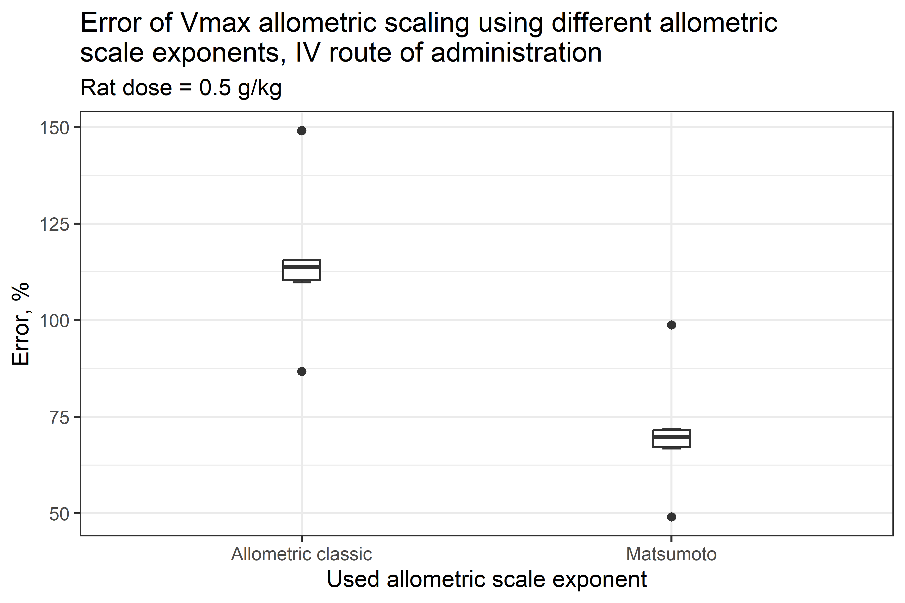

**PO route of administrations**

Rat data were available at 0.75 and 3.0 g/kg doses, whereas human data were limited to ≤0.70 g/kg.

At the rat dose of 0.75 g/kg, the elimination phase was not captured in the averaged data, precluding estimation of Beta; therefore, scaling results are based on Vd only.

*Dose 0.75 g/kg*

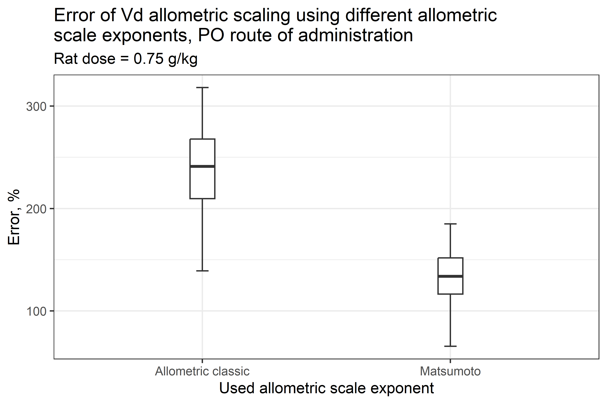

*Dose 3 g/kg*


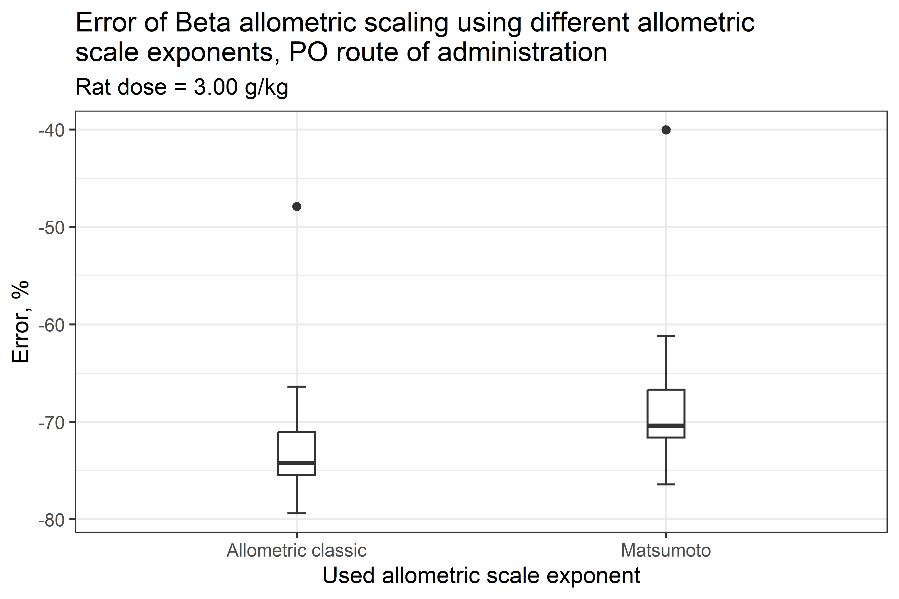

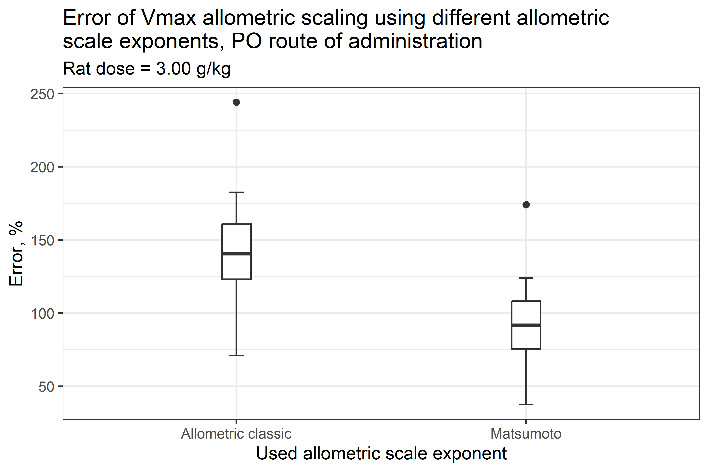

## Software Requirements

Statistical analysis was performed using R version 4.5.1 with RStudio 2025.09.1 Build 401.

Please, use

``` r
renv::restore()
```

to restore all dependencies. All packages and requirements are recorded in 'renv.lock' file.

# Contributors

**Students**:

1)  [Anna Vronskaia](https://github.com/annavronskaia) (*BIOCAD, St. Petersburg*)

Contribution: data preparation, individual dataset analysis, regression analysis.

2)  [Alexey Gordeev](https://github.com/deigord) (*Almazov National Medical Research Centre, St. Petersburg*)

Contribution: data preparation, functional programming, regression analysis, allometric scaling, repository management.

3)  [Ekaterina Danilina](https://github.com/kat-dani) (*Kurgan State University, Kurgan*)

Contribution: data preparation, regression analysis.

4)  [Milana Sagitova](https://github.com/sagitowam) (*Sechenov University, Moscow*)

Contriobution: data preparation, regression analysis, allometric scaling.

5)  [Sergey Tsaregorodtsev](https://github.com/svtsar) (*Russian University of Medicine, Moscow*)

Contribution: data preparation, exploratory analysis, preparing presentations, writing thesis statements.

**Supervisor**:

[Alexander Petrov](https://github.com/petrov-aleks) (*University of Potsdam, Potsdam*)

## References

1.  Danpanichkul, P., Díaz, L. A., Suparan, K., Tothanarungroj, P., Sirimangklanurak, S., Auttapracha, T., Blaney, H. L., Sukphutanan, B., Pang, Y., Kongarin, S., Idalsoaga, F., Fuentes-López, E., Leggio, L., Noureddin, M., White, T. M., Louvet, A., Mathurin, P., Loomba, R., Kamath, P. S., … Arab, J. P. (2025). Global epidemiology of alcohol-related liver disease, liver cancer, and alcohol use disorder, 2000–2021. Clinical and Molecular Hepatology, 31(2), 525–547. <https://doi.org/10.3350/cmh.2024.0835>

2.  Holford, N. H. G. (1987). Clinical Pharmacokinetics of Ethanol. Clinical Pharmacokinetics, 13(5), 273–292. <https://doi.org/10.2165/00003088-198713050-00001>

3.  Ammon, E., Schäfer, C., Hofmann, U., & Klotz, U. (1996). Disposition and first-pass metabolism of ethanol in humans: Is it gastric or hepatic and does it depend on gender?\*. Clinical Pharmacology & Therapeutics, 59(5), 503–513. [https://doi.org/10.1016/S0009-9236(96)90178-2](https://doi.org/10.1016/S0009-9236(96)90178-2){.uri}

4.  Thierauf-Emberger, A., Schuldis, D., Dacko, M., & Lange, T. (2023). Ethanol Kinetics in the Human Brain Determined by Magnetic Resonance Spectroscopy. International Journal of Molecular Sciences, 24(17), 13499. <https://doi.org/10.3390/ijms241713499>

5.  Vestal, R. E., McGuire, E. A., Tobin, J. D., Andres, R., Norris, A. H., & Mezey, E. (1977). Aging and ethanol metabolism. Clinical Pharmacology & Therapeutics, 21(3), 343–354. <https://doi.org/10.1002/cpt1977213343>

6.  Wilkinson, P. K., Sedman, A. J., Sakmar, E., Earhart, R. H., Weidler, D. J., & Wagner, J. G. (1976). Blood ethanol concentrations during and following constant‐rate intravenous infusion of alcohol. Clinical Pharmacology & Therapeutics, 19(2), 213–223. <https://doi.org/10.1002/cpt1976192213>

7.  Wilkinson, P. K., Sedman, A. J., Sakmar, E., Kay, D. R., & Wagner, J. G. (1977). Pharmacokinetics of ethanol after oral administration in the fasting state. Journal of Pharmacokinetics and Biopharmaceutics, 5(3), 207–224. <https://doi.org/10.1007/BF01065396>

8.  Yelland, L. N., Burns, J. P., Sims, D. N., Salter, A. B., & White, J. M. (2008). Inter- and intra-subject variability in ethanol pharmacokinetic parameters: Effects of testing interval and dose. Forensic Science International, 175(1), 65–72. <https://doi.org/10.1016/j.forsciint.2007.05.011>

9.  Eriksson, C. J. P., & Sippel, H. W. (1977). The distribution and metabolism of acetaldehyde in rats during ethanol oxidation—I: The distribution of acetaldehyde in liver, brain, blood and breath. Biochemical Pharmacology, 26(3), 241–247. [https://doi.org/10.1016/0006-2952(77)90310-0](https://doi.org/10.1016/0006-2952(77)90310-0){.uri}

10. Kozawa, S., Yukawa, N., Liu, J., Shimamoto, A., Kakizaki, E., & Fujimiya, T. (2007). Effect of chronic ethanol administration on disposition of ethanol and its metabolites in rat. Alcohol, 41(2), 87–93. <https://doi.org/10.1016/j.alcohol.2007.03.002>
